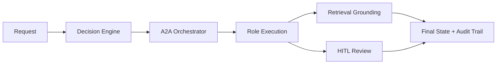

# Gov-Agentic AI

Governed **agent-to-agent (A2A) orchestration** baseline for public-sector workflows.

Gov-Agentic AI is an MVP repository for building AI workflows that are:
- **role-aware**
- **audit-aware**
- **retrieval-grounded**
- **human-reviewable**
- ready for integration with runtimes such as **Hermes** and **OpenClaw**

This is **not** a generic chatbot wrapper. It is a practical orchestration foundation for government knowledge work: drafting, review, routing, compliance, retrieval, and human approval.

> **Status:** MVP backbone active and runnable locally.

## Start here
- Read the architecture overview below
- Run `python3 scripts/verify_repo.py`
- Use `docs/integrations/AI_SETUP_PROMPTS.md` if you want an AI agent to clone, set up, or validate this repo from GitHub

---

## What this repo does

Repo ini memodelkan workflow multi-role yang punya:
- role registry sebagai source of truth
- decision engine untuk routing dan governance gating
- formal A2A contracts
- retrieval-backed evidence flow
- HITL review packet / decision / resume path
- smoke tests dan unit tests untuk validasi perilaku inti

Contoh workflow yang dicakup:
- drafting memo / naskah internal
- compliance dan legal review
- budget review
- procurement neutrality check
- archive / administrative routing
- escalation handling
- consequential actions dengan human approval

---

## What works today

MVP saat ini sudah punya:
- **canonical role registry** di `configs/role_registry.json`
- **decision engine** di `scripts/government_decision_engine.py`
- **A2A orchestrator** di `scripts/agent_to_agent_orchestrator.py`
- **contract validation** di `scripts/a2a_contracts.py`
- **retrieval grounding** via `scripts/local_retriever.py`
- **HITL review console** via `scripts/hitl_review_console.py`
- **regression fixtures** di `examples/agent-to-agent/`
- **smoke + unit tests** untuk jaga behavior inti

Representative governed path:
- **Yayak -> Alfian -> Edi -> human review -> final state**

---

## What this MVP proves

Repo ini sudah membuktikan arsitektur praktis untuk:
- **multi-role orchestration**
- **review-aware terminal states**
- **retrieval provenance preservation**
- **auditable human review decisions**
- **runtime-portable integration patterns**

Belum production platform penuh, tapi sudah cukup kuat untuk:
- technical demo
- architecture review
- integration planning
- controlled pilot
- GitHub publication sebagai serious MVP

---

## At a glance



Representative path:
- **Yayak** classifies and routes
- **Alfian** drafts or structures the artifact
- **Edi** reviews for compliance / governance fit
- workflow pauses for **human approval** when required
- final output preserves **evidence, review state, and audit events**

## Quickstart

### Verify repo
```bash
python3 scripts/verify_repo.py
```

### Run orchestrator example
```bash
python3 scripts/agent_to_agent_orchestrator.py \
  --input-json examples/agent-to-agent/yayak-alfian-edi.request.json \
  --pretty
```

### Run smoke tests
```bash
python3 scripts/smoke_test_agent_to_agent.py
python3 scripts/smoke_test_agent_to_agent_matrix.py
```

### Run unit tests
```bash
python3 -m unittest discover -s tests -v
```

### Run retrieval-backed example
```bash
python3 scripts/agent_to_agent_orchestrator.py \
  --input-json examples/agent-to-agent/retrieval-budget-review.request.json \
  --pretty
```

### Run HITL example
```bash
python3 scripts/agent_to_agent_orchestrator.py \
  --input-json examples/agent-to-agent/hitl-review.request.json \
  --pretty
```

---

## Core files

### Runtime backbone
- `configs/role_registry.json`
- `scripts/government_decision_engine.py`
- `scripts/agent_to_agent_orchestrator.py`
- `scripts/role_runtime_adapter.py`

### Contract layer
- `schemas/agent_to_agent_handoff.schema.json`
- `schemas/agent_to_agent_response.schema.json`
- `schemas/agent_to_agent_audit_event.schema.json`
- `schemas/agent_to_agent_terminal_state.schema.json`
- `schemas/hitl_review_decision.schema.json`
- `scripts/a2a_contracts.py`

### Retrieval + HITL
- `scripts/local_retriever.py`
- `configs/retrieval.generated.json`
- `examples/retrieval-corpus/government_sources.json`
- `scripts/hitl_review_console.py`

---

## Example fixtures

Regression fixtures di `examples/agent-to-agent/` saat ini meliputi:
- `yayak-alfian-edi.request.json` — drafting + compliance review
- `budget-review.request.json` — budget review via **Anastasia**
- `procurement-neutrality.request.json` — procurement neutrality via **Hafidus**
- `archive-record.request.json` — archive routing via **Sovia -> Izza**
- `escalation-blocker.request.json` — escalation path dengan terminal `needs_review`
- `retrieval-budget-review.request.json` — retrieval-backed budget review
- `hitl-review.request.json` — HITL path dengan review packet, decision, dan resume flow

---

## Docs worth reading

### Architecture
- `docs/architecture/AGENT_TO_AGENT_CONTRACTS_AND_RUNTIME.md`
- `docs/architecture/A2A_RUNTIME_HARDENING.md`
- `docs/architecture/A2A_RETRIEVAL_INTEGRATION.md`
- `docs/architecture/A2A_HITL_REVIEW_CONSOLE.md`
- `docs/architecture/GOVERNMENT_WORK_LOGIC.md`
- `docs/architecture/REPO_CONTRACT.md`

### Setup prompts for AI agents
- `docs/integrations/AI_SETUP_PROMPTS.md`

---

## Hermes / OpenClaw note

Repo ini belum memberi native SDK integration penuh, tapi sudah punya pola yang cukup bersih untuk:
- command-bridge runtime execution
- local validation
- retrieval-backed orchestration
- human approval flow
- future integration ke Hermes/OpenClaw runtime surface

---

## Legacy materials

Material installer/runtime-packaging lama yang bukan bagian dari MVP aktif sudah dipindahkan ke:
- `APUS DONG/`

Tujuannya supaya surface repo utama tetap fokus ke orchestration backbone yang aktif.

---

## Next recommended steps

Kalau mau lanjut setelah repo ini:
1. tambahin connector retrieval nyata
2. bikin governance/review UI
3. tambah persistent audit storage
4. bangun runtime integration yang lebih native untuk Hermes/OpenClaw
