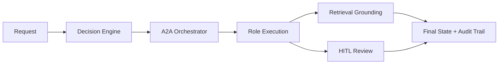

# Gov-Agentic AI

Governed **agent-to-agent (A2A) orchestration** baseline for public-sector workflows.

Gov-Agentic AI is an MVP repository for building AI workflows that are:
- **role-aware**
- **audit-aware**
- **retrieval-grounded**
- **human-reviewable**
- ready for integration with runtimes such as **Hermes** and **OpenClaw**

This is **not** a generic chatbot wrapper. It is a practical orchestration foundation for government knowledge work, including routing, review, compliance, retrieval, and human approval.

> **Status:** MVP backbone active and runnable locally.

## Start here
- Read the architecture overview below
- Run `python3 scripts/verify_repo.py`
- Use `docs/integrations/AI_SETUP_PROMPTS.md` if you want an AI agent to clone, set up, or validate this repository from GitHub

---

## What this repository does

This repository models governed multi-role AI workflows with:
- a canonical role registry
- a decision engine for routing and governance gating
- formal A2A contracts
- retrieval-backed evidence flow
- a human-in-the-loop review packet / decision / resume path
- smoke tests and unit tests for core behavior validation

---

## What works today

The current MVP includes:
- **canonical role registry** in `configs/role_registry.json`
- **decision engine** in `scripts/government_decision_engine.py`
- **A2A orchestrator** in `scripts/agent_to_agent_orchestrator.py`
- **contract validation** in `scripts/a2a_contracts.py`
- **retrieval grounding** via `scripts/local_retriever.py`
- **HITL review console** via `scripts/hitl_review_console.py`
- **regression fixtures** under `examples/agent-to-agent/`
- **smoke and unit tests** for core workflow validation

---

## What this MVP proves

This repository demonstrates a practical baseline for:
- **multi-role orchestration**
- **review-aware terminal states**
- **retrieval provenance preservation**
- **auditable human review decisions**
- **runtime-portable integration patterns**

It is not yet a full production platform, but it is strong enough for:
- technical demos
- architecture reviews
- integration planning
- controlled pilots
- GitHub publication as a serious MVP

---

## At a glance



The workflow classifies requests, routes them across governed roles, grounds outputs with evidence when needed, pauses for human review when required, and produces auditable final states.

---

## Quickstart

### Verify repository integrity
```bash
python3 scripts/verify_repo.py
```

### Run the orchestrator example
```bash
python3 scripts/agent_to_agent_orchestrator.py \
  --input-json examples/agent-to-agent/yayak-alfian-edi.request.json \
  --pretty
```

### Run smoke tests
```bash
python3 scripts/smoke_test_agent_to_agent.py
python3 scripts/smoke_test_agent_to_agent_matrix.py
```

### Run unit tests
```bash
python3 -m unittest discover -s tests -v
```

### Run a retrieval-backed example
```bash
python3 scripts/agent_to_agent_orchestrator.py \
  --input-json examples/agent-to-agent/retrieval-budget-review.request.json \
  --pretty
```

### Run a HITL example
```bash
python3 scripts/agent_to_agent_orchestrator.py \
  --input-json examples/agent-to-agent/hitl-review.request.json \
  --pretty
```

---

## Core files

### Runtime backbone
- `configs/role_registry.json`
- `scripts/government_decision_engine.py`
- `scripts/agent_to_agent_orchestrator.py`
- `scripts/role_runtime_adapter.py`

### Contract layer
- `schemas/agent_to_agent_handoff.schema.json`
- `schemas/agent_to_agent_response.schema.json`
- `schemas/agent_to_agent_audit_event.schema.json`
- `schemas/agent_to_agent_terminal_state.schema.json`
- `schemas/hitl_review_decision.schema.json`
- `scripts/a2a_contracts.py`

### Retrieval and HITL
- `scripts/local_retriever.py`
- `configs/retrieval.generated.json`
- `examples/retrieval-corpus/government_sources.json`
- `scripts/hitl_review_console.py`

---

## Documentation

### Architecture
- `docs/architecture/AGENT_TO_AGENT_CONTRACTS_AND_RUNTIME.md`
- `docs/architecture/A2A_RUNTIME_HARDENING.md`
- `docs/architecture/A2A_RETRIEVAL_INTEGRATION.md`
- `docs/architecture/A2A_HITL_REVIEW_CONSOLE.md`
- `docs/architecture/GOVERNMENT_WORK_LOGIC.md`
- `docs/architecture/REPO_CONTRACT.md`

### AI setup prompts
- `docs/integrations/AI_SETUP_PROMPTS.md`

---

## Runtime integration note

The repository does not yet provide full native SDK integration for Hermes or OpenClaw, but it already establishes a clean baseline for:
- command-bridge runtime execution
- local validation workflows
- retrieval-backed orchestration
- human approval paths
- future runtime-native integration work
